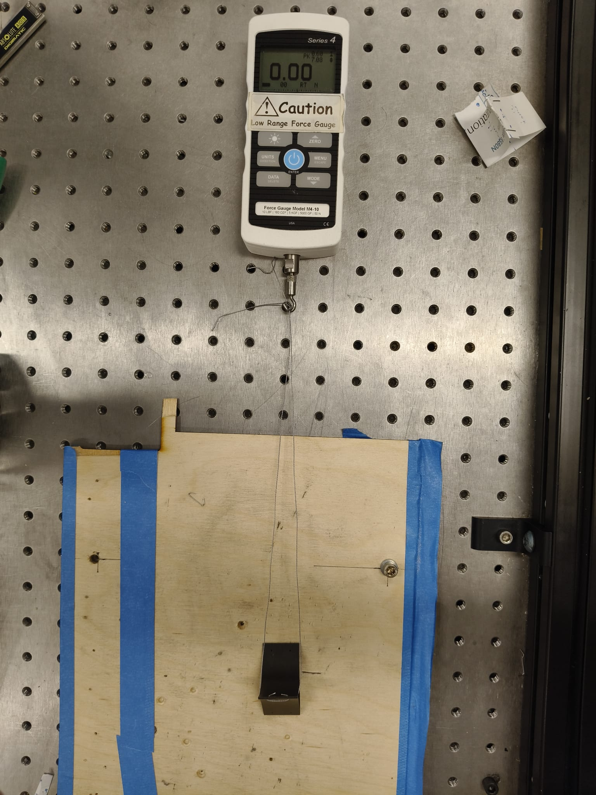

  <h1>OptiTrack for documenting Positioning and Trajectory</h1>
  <h3>Updated 04/14/2025</h3>

## About

The stability of the ankle in the pogo stick-type model is characterized through a separate controlled experiment using a Motion Capture setup. This setup is designed to find out the trajectory and stability of our designed ankle design using OptiTrack.

 

## Flowchart

graph TD
    A[Project Setup] --> B[Define Experiment Parameters]
    B --> C[ROS2-Based Software Configuration]
    C --> D[Conduct Experiment]
    D --> E[Data Collection]
    E --> F[Analysis]
    F --> G{Iterate?}
    G -->|Yes| D
    G -->|No| H[Report Findings-find trajectory]

 

## OptiTrack Setup

- <b>Project Setup:</b> The setup contains an object which, for this project, is a prototype of an ankle + leg of a quadruped similar to a pogostick model, with reflective markers to facilitate OptiTrack in capturing the data.  
- <b>Define Experiment Parameters:</b> The parameters involve setting up the placement of the reflective sensors, and defining the ground frame and the rigid body in the MOTIVE GUI.  
- <b>ROS-Based Software Configuration:</b> The OptiTrack sends its data to a software named MOTIVE which can be accessed on the Virtual Machine via Ethernet. ROS2 is used to visualize the published data. A GUI can also be constructed using PyQT5 which will: 
  1. Visualize the Data (serially showing the Cartesian coordinates and quaternions with timestamps). 
  2. Contain a button to start and stop recording. 
  3. A recording system to save the data into a <b>bagfile</b> or a <b>csv</b> file.  
- <b>Conduct Experiment:</b> The prototype is physically dropped, and trajectories are tracked by the motion capture system.  
- <b>Data Collection:</b> Coordinates and quaternions are collected.  
- <b>Analysis:</b> Data is visualized via GUI using PyQT.  
- <b>Iterate (if necessary):</b> Adjust parameters and repeat if needed.  
- <b>Report Findings:</b> Findings are compiled for simulation and future enhancements.

 

   
  <b>Figure 2:</b> Setup for calculating. The displacements will be reached via human hand, preferably via an UR5 to reduce human error.

## Hardware Configuration

The specimen is dropped from a fixed height and angle. Reflective markers measure its movement and stability. This provides insight into the effectiveness of the ankle attachment.  
<b>Hardware involved:</b> 
- <b>OptiTrack:</b> Uses reflective IR markers and IR camera setup for accurate tracking. 
- <b>Mounting Fixture:</b> The specimen is free-fallen by hand. 
- <b>Data Acquisition:</b> MOTIVE software streams the data to the user machine via Ethernet.

 

## Data Conditioning and Analysis

- <b>Conditioning:</b> The rigid body is configured in Motive with proper marker layout and labeling. Data is streamed into ROS2 via a dedicated bridge.  
- <b>Filtering:</b> A Savitzky-Golay or Butterworth filter can be applied to position data. Differentiation is used for velocity and acceleration. Filtering is handled by a ROS2 node.  
- <b>Repeatability Check:</b> Conducted to ensure consistent results.  
- <b>Units and Normalization:</b> Data is standardized to SI units and normalized for simulation comparisons.

 

## Software Configuration

### OptiTrack Node

- Publishes 6-DOF pose data from MOTIVE to ROS2. 
- Topic published: <b>/ankle/pose</b>. 
- Rigid body configurations are passed via a YAML parameter file.

 

### Filtering Node

- Applies real-time filtering to smooth noisy measurements. 
- Filters: Butterworth or Savitzky-Golay. 
- Outputs: 
  - <b>/ankle/pose_filtered</b> 
  - <b>/ankle/velocity</b> 
  - <b>/ankle/acceleration</b>

 

## Node Communication

graph LR
  OPTI[/optitrack_node/] --> POSE[/ankle/pose/]
  POSE --> FILTER[/filter_node/]
  FILTER --> POSEF[/ankle/pose_filtered/]
  FILTER --> VEL[/ankle/velocity/]
  FILTER --> ACC[/ankle/acceleration/]

 

## Experimentation

OptiTrack was calibrated for a controlled environment. The videos below show our team working at IDEALab to calibrate and capture pose data using Python. Future work includes applying ROS2 filters to clean and refine data in real-time.

 

  <iframe width="560" height="315" src="https://www.youtube.com/embed/dQw4w9WgXcQ" frameborder="0" allowfullscreen></iframe>  
  <iframe width="560" height="315" src="https://www.youtube.com/embed/dQw4w9WgXcQ" frameborder="0" allowfullscreen></iframe>

