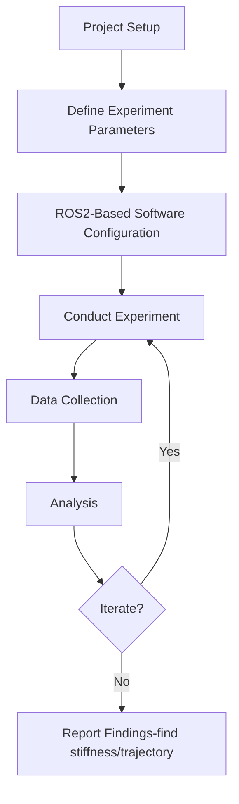

# Stiffness Measurement via Force Gauge and ROS2

## About
    
The stiffness of the ankle in the pogo stick-type model is characterized through a separate controlled experiment using a force-displacement test setup. This setup is designed to find out loads to the ankle joint and measure the corresponding load, allowing the finding of accurate force-displacement points.

>**Figure 1:** Process flow chart for the experiment.

### Force Gauge setup
- *Project Setup:* The setup contains an object which, for this project, an prototype of a ankle + leg of a quadruped similar to a pogostick model, with a Force Gauge ready to record data. 
- *Define Experiment Parameters:* A setup in which the model is fixated to the gournd and a string is used to attached the leg and a hook of the force gauge. A set of displacement points are marked and the force gauge readings are taken at those points. The values are graphed out and the best fit is made to find the stifness. 
- *ROS-Based Software Configuration:* The data of the Force readings are published and subscribed via ROS2 software to visualize the data. A GUI is also constructed using PyQT5 which will: 
  - 1. Visualize the Data( 2-D Plot of Force data with respect to time).
    2. Contain a button to start and stop recording
    3. A recording system to save the data into a _bagfile_ or a _csv_ file.
4. *Conduct Experiment:* The prototype is physically dropped, with the force gauge recording the force values with respect to time.
5. *Data Collection:* Sensor data are collected, in this case Force and displacement.
6. *Analysis:* Data are visualized on a graph using PyQT.
7. *Iterate (if necessary):* Conduct experiments with adjusted parameters if needed for confirmation.
8. *Report Findings:* Findings are compiled, and conclusions are provided for simulations and future improvements.

>
>**Figure 2:** Setup for calculating. The displacements will be reached via human hand, preferably via an UR5 to reduce human error.

## Hardware Configuration
    
The specimen or test object is fixated on the ground via supports and screws and via strings, the specimen is attached to the hook attachment of a Force Gauge which is placed horizontally and tensile forces are added onto the ankle component to get the reading. 

The Force Gauge will pass through a few marked displacement points and the force readings are plotted to find a best fit. 

The hardware involved are:
- **Force Gauge:** For this experiment, a high-precision digital force gauge is used, a [Mark-10 M4-10 force gauge](https://mark-10.com/products/force-gauges/series-4/).   
- **Displacement Measurement:** Displacement are marked via a ruler and the force gauge is physically pulled to the displacement points. 
- **Mounting Fixture:** A custom test rig is bult to hold the ankle in position which will isolate the axis along which the stiffness is being tested. 
    Allows for controlled compression of the ankle ensuring consistent boundary conditions during each test.
- **Data Acquisition:** 
    Force reading is continuously logged from the gauge via serial interface or USB using a custom ROS2 node.

## Data Conditioning and Analysis:

- **Repeatability Check:**
Multiple trials are conducted under identical conditions to assess repeatability and account for any mechanical hysteresis or viscoelastic effects.

- **Units and Normalization:**
Data is converted into consistent SI units and normalized (if necessary) based on geometry or mass to enable direct comparison with simulation models.

## Software Configuration
The force gauge is connected to the system via serial communicator (USB provided by the manufacturer). 

The goal of using ROS2 is to serve three purposes
- To visualize graphically the force readings.
- Create a GUI and show the data have a button to start and stop recording. 
- Upon pressing the button, the GUI will automatically create a *csv* and *ros2bag* file, useful for post-processing.

Using ROS2 we created a publisher and subscriber nodes.
- The *publisher node* will acess the data from the serial communicator and publish a topic '\force_reading' which continuously updates the force reading from the force gauge.
- The *subscriber node* subscribes the topic and performs the following:
1. Visualizes graphically the force readings.    
2. Create a GUI and show the data have a button to start and stop recording. 
3. Upon pressing the button, the GUI will automatically create a *csv* and *ros2bag* file, useful for post-processing.

<!-- Needs an image of rqt_graph -->

## Experimentation

Figure 1 (shown below) is an image of the GUI when performing the experiment. 