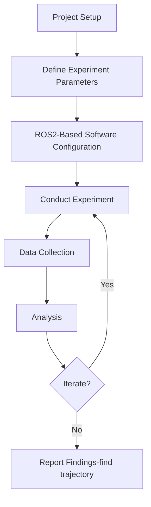

# OptiTrack for documenting Positioning and Trajectory

## About
    
The stability of the ankle in the pogo stick-type model is characterized through a separate controlled experiment using an Motion Capture setup. This setup is designed to find out the trajectory and stability of our designed ankle design using OptiTrack. 

>**Figure 1:** Process flow chart for the experiment.

### Force Gauge setup
- *Project Setup:* The setup contains an object which, for this project, an prototype of a ankle + leg of a quadruped similar to a pogostick model, with reflective markers to facilitate the OptiTrack in capturing the data. 
- *Define Experiment Parameters:* The parameters involve setting up the placement of the reflective sensors, and defining the ground frame and the rigid body in the MOTIVE GUI . 
- *ROS-Based Software Configuration:* The Optitrack sends it data to a particular software named MOTIVE which can be accesed to the Virtual Machine via ethernet. ROS2 will be used to       access the data of the force readings are published and subscribed via ROS2 software to visualize the data. A GUI can also constructed using PyQT5 which will: 
  - 1. Visualize the Data (Serially show the cartesian coordinates and the quaternions with time stamp).
    2. Contain a button to start and stop recording.
    3. A recording system to save the data into a _bagfile_ or a _csv_ file.
4. *Conduct Experiment:* The prototype is physically dropped, with the trajectories being tracked by motion capture of OptiTrack.
5. *Data Collection:* Sensor data are collected, in this case Coordinates and Quaternions.
6. *Analysis:* Data are visualized via GUI using PyQT.
7. *Iterate (if necessary):* Conduct experiments with adjusted parameters if needed for confirmation.
8. *Report Findings:* Findings are compiled, and conclusions are provided for simulations and future improvements.

>
>**Figure 2:** Setup for calculating. The displacements will be reached via human hand, preferably via an UR5 to reduce human error.

## Hardware Configuration
    
The specimen or test object is physically dropped at a fixed height and angle and the reflective markers on the specimen meaure how the specimen moves in the controlled space and its contact with the ground. This will help study on the stability of the ankle attachment. 
The hardware involved are:
- **Optitrack:** For this experiment, reflective IR markers are used and a specialized IR camera setup, OptiTrack, to accurately find track the markers.  
- **Mounting Fixture:** The specimen is held by hand and is physically free-falled on the ground . 
- **Data Acquisition:** The data is acquired from the MOTIVE software and is sent to the user machine via the ethernet.

## Data Conditioning and Analysis:

- **Conditioning:** Rigid body is configured in Motive, with appropriate marker layout and labeling to ensure robust tracking even under rapid motion. Data is streamed into ROS2 via a dedicated bridge.
- **Filtering:** A Savitzky-Golay filter or low-pass Butterworth filter can be applied to the position data to smooth out high-frequency noise. Numerical differentiation (post-filtering) is used to compute velocity and acceleration. Filtering can be done in a dedicated ROS2 node, ensuring real-time processing and low-latency feedback for triggering or control events.
- **Repeatability Check:** Multiple trials are conducted under identical conditions to assess repeatability.
- **Units and Normalization:**
Data is converted into consistent SI units and normalized (if necessary) based on geometry or mass to enable direct comparison with simulation models.

## Software Configuration

### Optitrack Node:
- A dedicated bridge node is used to stream 6-DOF pose data from MOTIVE into ROS2
- This node is a publisher, giving data for each rigid body setup. It publishes a topic: /ankle/pose.
- The rigid body configurations are stored in a yaml file passed as a ROS2 parameter

### Filtering Node:
- Applies real time filtering to remove measurement noise.
- Suitable filters include Butterworth or Savitzky-Golay filter to smooth position signal.
- New topics after filter - /ankle/pose_filtered
- Velocity and accelerationa can be computed via numerical differentiation after filtering.

Below is an graph of the communications of nodes in ROS2

''' mermaid
graph LR
  OPTI[/optitrack_node/] --> POSE[/ankle/pose/]
  POSE --> FILTER[/filter_node/]
  FILTER --> POSEF[/ankle/pose_filtered/]
  FILTER --> VEL[/ankle/velocity/]
  FILTER --> ACC[/ankle/acceleration/]
'''
<!-- Needs an image of rqt_graph -->

## Experimentation
As per current progress, we calibrated the OptiTrack to our controlled environment. The below shows video of our team working at IDEALab and calibrating and obtaining pose data via python on Windows. Future works will involve implementing on ROS2 and filters to smoothen out data.

<iframe width="560" height="315" 
src="https://www.youtube.com/embed/dQw4w9WgXcQ" 
frameborder="0" allowfullscreen></iframe>

<iframe width="560" height="315" 
src="https://www.youtube.com/embed/dQw4w9WgXcQ" 
frameborder="0" allowfullscreen></iframe>
