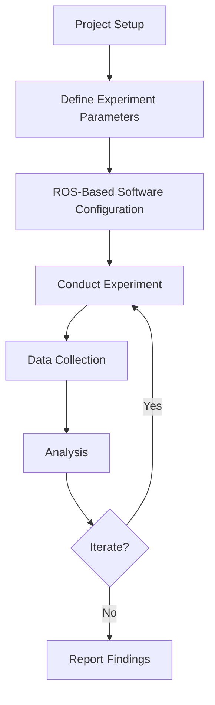
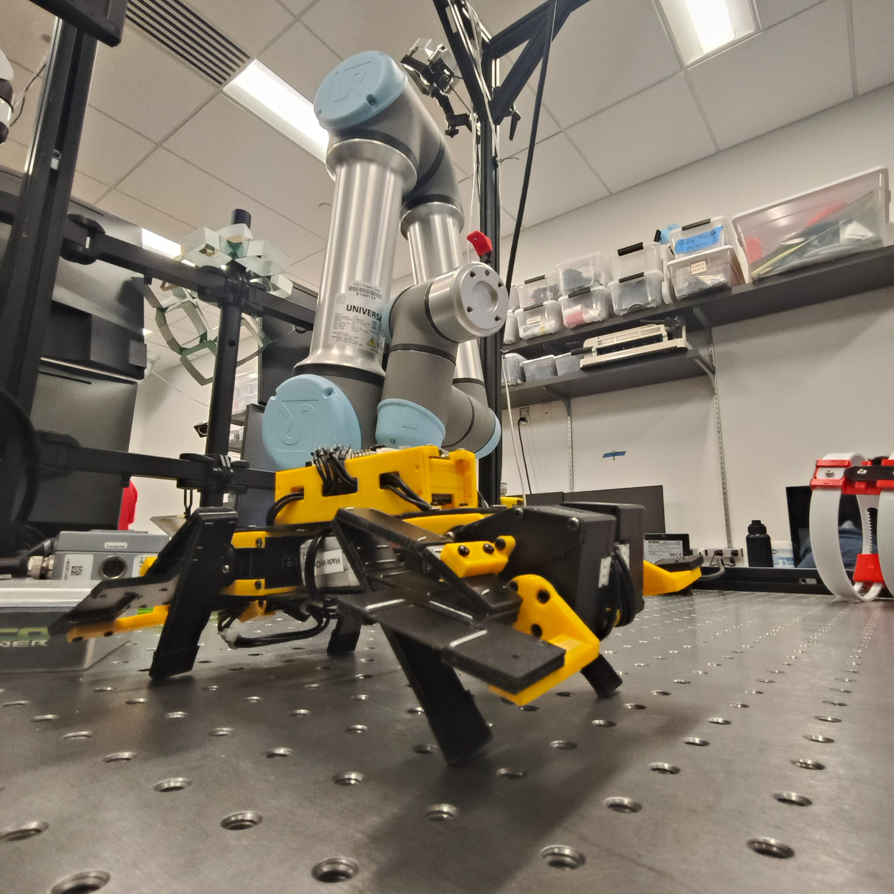
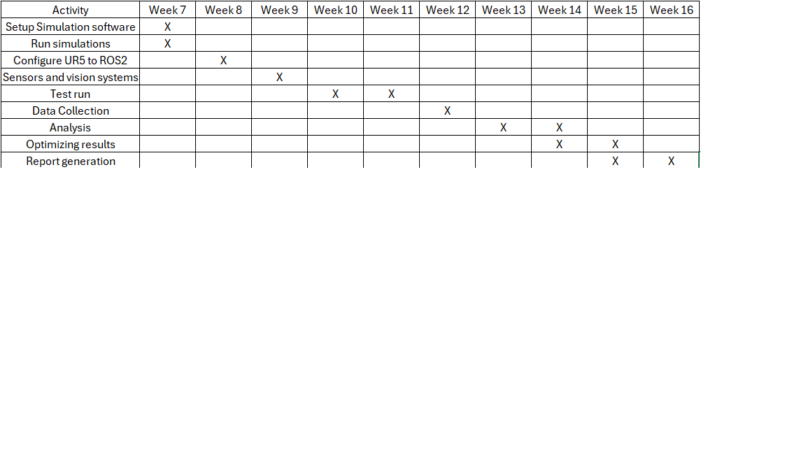

# Experimental Test Drop Setup Using OptiTrack and Force Gauge
## A. About
<table>
  <tr>
    <td>Team Number</td>
    <td>04</td>
  </tr>
  <tr>
    <td>Team Members</td>
    <td>Vijaya Malhaar Gaddam, Harshavardhan Karancheti</td>
  </tr>
  <tr>
    <td>Semester, Year</td>
    <td>Spring, 2025</td>
  </tr>
  <tr>
    <td>Professor</td>
    <td>Dr. Daniel Aukes</td>
  </tr>
  <tr>
    <td>University</td>
    <td>Arizona State University</td>
  </tr>
</table>

## B. The Project

The objective of this experiment is to validate the stiffness and porjectile of the ankle of a pogo stick type model in a lab environment. This project will help investigate the impact of varying release heights, release angle, and object characteristics which will be used to establish parameters and compare to the simulations.

## C. Research Question
 
***"How do we get simulation parameters to measure the stiffness and projectile of an ankle design for stability in a quadruped?"***  

This study contributes to modeling research by evaluating robotic parts designs in various manufacturing and logistics applications.

## D. Concept

The project involves using OptiTrack via ROS to drop test objects at predetermined positions. A vision system, will record drop points and trajectories and a force gauge is attached to the object to measure the stiffness and deformation. The analysis will be on the deviation in path deformations, how factors such as object weight and shape influence it and how it relates to the simulation readings. ROS2 software will use a node to publish the sensors to ensure repeatability in the experiment. The process flow chart of our project is shown in the chart below.

>**Figure 1:** Process flow chart for the experiment.

1. *Project Setup:* The setup contains an object which, for this project, an prototype of a ankle + leg of a quadruped similar to a pogostick model, with a OptiTrack continaing IR reflectors and vision system ready to record data. An sound sensor is used to detect contact. A force gauge is also installed to measure deformation.
2. *Define Experiment Parameters:* Points of placement of reflector sensors are selected along with angles and heights to drop from.
3. *ROS-Based Software Configuration:* The data of the movement from the OptiTrack and the force gauge are published and subscribed via ROS2 software to visualize the data.
4. *Conduct Experiment:* The prototype is physically dropped, with the sensors and vision system recording the drop locations and trajectories, and deformation values.
5. *Data Collection:* Vision system and sensor data are collected, such as trajectories.
6. *Analysis:* Data are visualized on a graph using PyQT.
7. *Iterate (if necessary):* Conduct experiments with adjusted parameters if needed for confirmation
8. *Report Findings:* Findings are compiled, and conclusions are provided for future improvements.

## E. Sensor Intergration
  This project aims to develop a ROS 2-based robotic manipulation system that integrates *OptiTrack motion capture technology*, and force gauge for measuring simulation parameters. The goal is to drop them from a random height and angle and utilize the OptiTrack and find the projected trajectories. ROS 2 will be used for processing and obtaining sensor information and real-time communication, ensuring seamless coordination between different sensor data. This experiment will help in supporting the simulation data of a similar model in *MujoCo*.
  
  The OptiTrack motion capture system will provide for improved tracking.   
  By leveraging ROS 2’s distributed architecture, this project will enhance trajectory adaptation in real-time. The combination of motion capture (OptiTrack) will enable high-accuracy object handling. The findings from this experiment will have broader applications in industrial automation, assistive robotics, and testing.

## F. Interface
The sensor data will be obtained using ROS2, leveraging MuJoCo for simulation comparision and custom ROS2 nodes for real-time interaction. The behavior of the robot will be influenced through:
1. Vision-based Perception: OptiTrack motion capture data will be fused to provide high-accuracy object localization.
2. Adaptive Motion Planning: ROS2 will handle trajectory updates dynamically, allowing the robot to adjust its movements based on real-time feedback.

### Interfaces for Interaction, Visualization, and Data Storage
To facilitate monitoring and user interaction, the following interfaces will be developed:
1.	*Simulation:* Used for real-time visualization of the robot’s workspace under control environment, including object positions, planned trajectories, and motion execution.
2.	*Web-Based Dashboard:* A user-friendly interface displaying object tracking data, and force gauge readings.
3.	*Data Logging System:* All relevant data (object positions, timestamps, drop locations, and trajectory corrections) will be stored in a ROS 2-based database for post-experiment analysis.

## G. Control and Autonomy

A *low-latency feedback loop* will be established to provide real-time feedback to the UR5 controller where sensor data is processed and transmitted. 
This enables the UR5 inverse kinematics and control algorithms to dynamically adjust grip strength and drop execution in real-time. 
A *High-Level decision-making module* will also read long-term trends from sensor feedback to make higher-level decisions. When systematic errors in drop accuracy occur, the system will adjust its release strategies, i.e., altering grip pressure or release angles, to improve performance.

## H. Resources needed

Since we heavily require camera sensing and sensor fusion, we would be needing knowledge about Control Systems and Autonomous Algorithms, Computer Vision, Object tracking and Sensor Fusion and Filtering Techniques. To run simulations for data comparisions, we would also need knowledge of Mujoco. Furthemore, self study and expert advice will go a long way in covering the gaps.

## I. Final Demonstration

### Resources needed from IDEALab

1. *OptiTrack Motion Capture System* – Infrared cameras for real-time tracking.
2. *Computer with GPU Support* – High-performance system for ROS2 and computer vision.
6. *Network Infrastructure* – Ethernet and/or Wi-Fi for seamless communication.
7. *Test Object* - Quadruped Robot or a prototype.

>
>**Figure 2:** Demonstation Setup.

### Changes in environmental conditions:

1. To handle variability in the environment, the robot will leverage sensor fusion by combining OptiTrack motion capture for global positioning and force gauge for precise local object tracking, ensuring robust localization and more research data.
3. In case of misalignment, the system will implement error recovery strategies, such as reattempting detection and adjusting the pick position. Additionally, ROS 2-based dynamic reconfiguration will allow real-time parameter tuning and trajectory modifications, supported by a web-based interface for manual overrides. This integrated approach ensures the system remains resilient and adaptable in dynamic environments, maintaining precise and reliable object manipulation.

## J. Impact

Our team has no prior experience with ROS2, sensor fusion, or object detection, making this a valuable challenge for us to advance in robotic experimentation. We are focused on developing a robust and standalone test procedure for dropping test materials from a height. 
This process can be applied to material testing, orientation-based drop tests, impact conditioning, and assessing real-world behavior under critical conditions. Such a testing framework could significantly enhance rescue operations by evaluating the impact on a robot when deployed from higher floors, such as the 4th or 5th, ensuring better reliability in high-stakes scenarios.

## K. Advising

We will be mentored by Dr. Daniel M. Aukes, who has expressed his interest in providing mentoring and access to state-of-the-art hardware facilities. Dr. Aukes' guidance will be a key factor in ensuring the technical aspects of the project are addressed effectively. His demands involve regular progress tracking, strict adherence to project milestones, and active participation in troubleshooting sessions. Other facilities, such as laboratory access and state-of-the-art simulation tools, have been guaranteed to aid in our experimental setup.

### Timeline
>
>**Figure 3:** Tentative Schedule.
